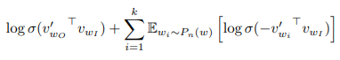

# Word2Vec (Skip-Gram with Negative Sampling) — NumPy Implementation
 
This repository contains an implementation of Word2Vec (Skip-Gram with Negative Sampling) using numpy only (no PyTorch / TensorFlow or other ML frameworks)

---

## Features

* Skip-Gram with Negative Sampling (SGNS)
* Fully NumPy-based implementation
* Manual forward pass and backpropagation
* Gradient checking to verify correctness
* Unigram negative sampling with power 0.75
* Training on a cleaned news dataset
* Word similarity search using cosine similarity
* Embedding visualization and clustering

---

## Model Overview

The model follows the Skip-Gram architecture, where a center word is used to predict surrounding context words.

Instead of computing the full softmax over the vocabulary, the model uses Negative Sampling, which turns the problem into several binary classification tasks.

Objective function:




---

## Evaluation

The learned embeddings are evaluated through several experiments:

* Word similarity search
* 2D embedding visualization
* Semantic clustering of related words
* Analysis of morphological patterns (e.g., singular–plural forms)

The notebook includes interactive visualizations. For the best viewing experience, it is recommended to run the notebook in Google Colab.

---

## Project Structure

```
train_word2vec_sgns_evaluate.ipynb
```

The notebook contains the full pipeline:

1. Data preprocessing
2. Word2Vec implementation
3. Gradient checking
4. Model training
5. Embedding evaluation and visualization

---

## Technologies

* Python
* NumPy
* Matplotlib
* Scikit-learn

---

## References

* https://arxiv.org/pdf/1310.4546
* https://cs231n.github.io/neural-networks-3/

---

